# Étape 3 — Diagrammes (C4, ERD, Flux métier)

**Projet :** SILARIS — Plateforme de Gestion de Transit International (TMS)
**Version :** 1.0
**Statut :** En attente de validation
**Prérequis :** Étapes 1–2 validées
**Format :** Mermaid (rendu natif GitHub, VS Code, GitLab)

---

## 1. C4 — Niveau 1 : Diagramme de contexte

Qui utilise SILARIS et avec quels systèmes il communique.

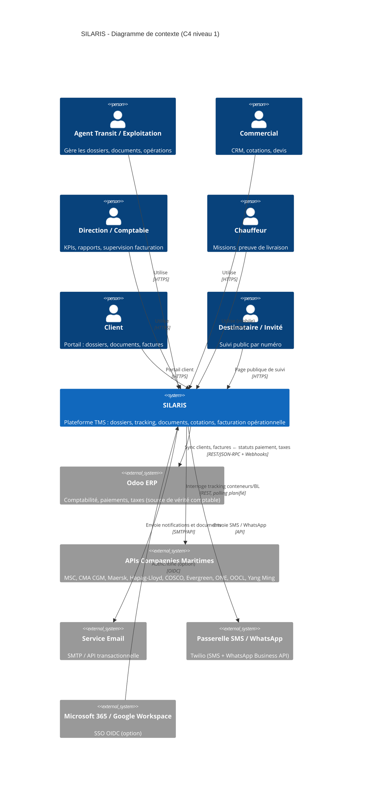

---

## 2. C4 — Niveau 2 : Diagramme de conteneurs

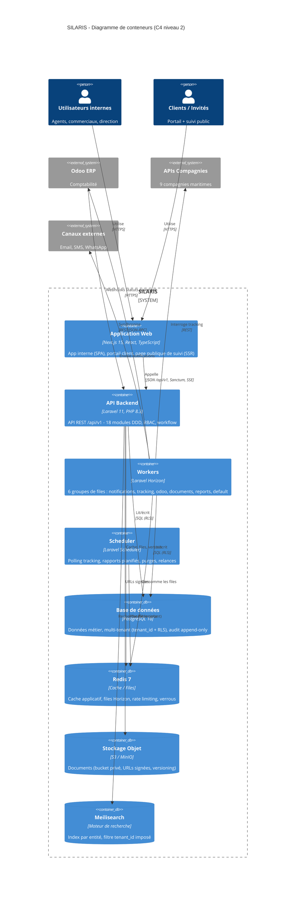

---

## 3. C4 — Niveau 3 : Composants du module Shipment (représentatif)

Structure identique pour tous les modules métier.

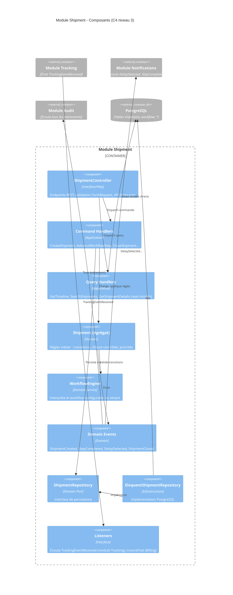

---

## 4. C4 — Niveau 3 : Composants CarrierConnect (connecteurs)

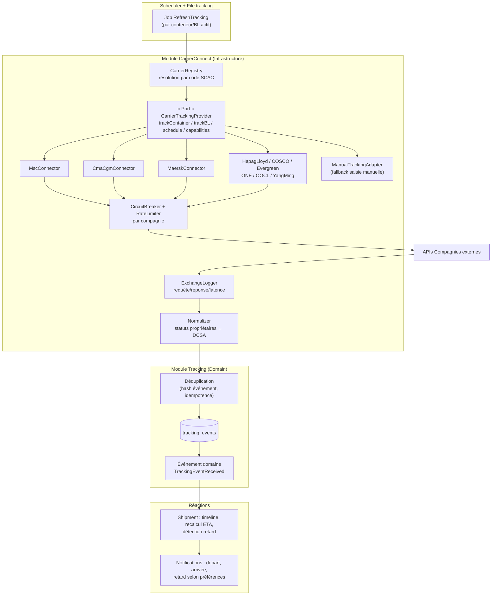

---

## 5. ERD — Modèle de données (vue d'ensemble)

ERD de conception : entités et relations principales (~50 tables cœur). Dictionnaire de données complet, index et contraintes à l'Étape 6.

### 5.1 Tenancy, Identity, Référentiels

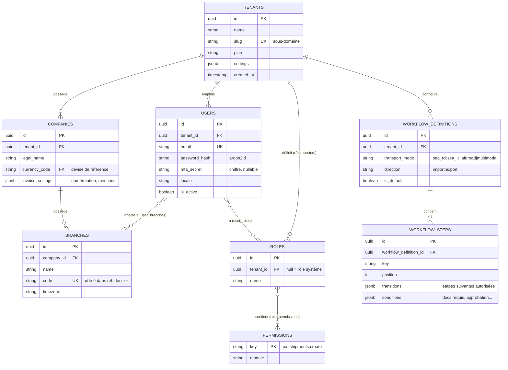

Référentiels globaux (sans tenant_id) : `countries`, `ports` (UN/LOCODE), `airports` (IATA), `currencies` + `exchange_rates` (datés), `incoterms`, `carriers` (maritimes, SCAC), `airlines` (préfixe AWB), `goods_types` (dont classes IMO/DGR).

### 5.2 CRM

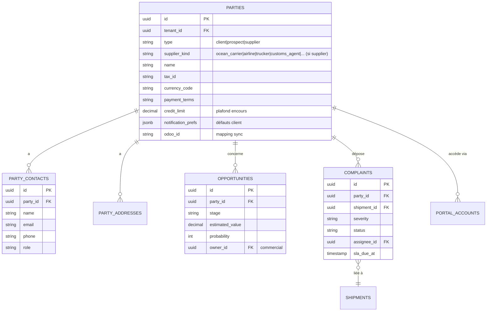

### 5.3 Dossiers (Shipment) — cœur du système

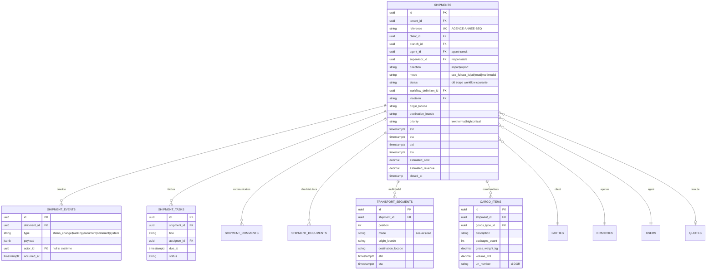

### 5.4 Maritime

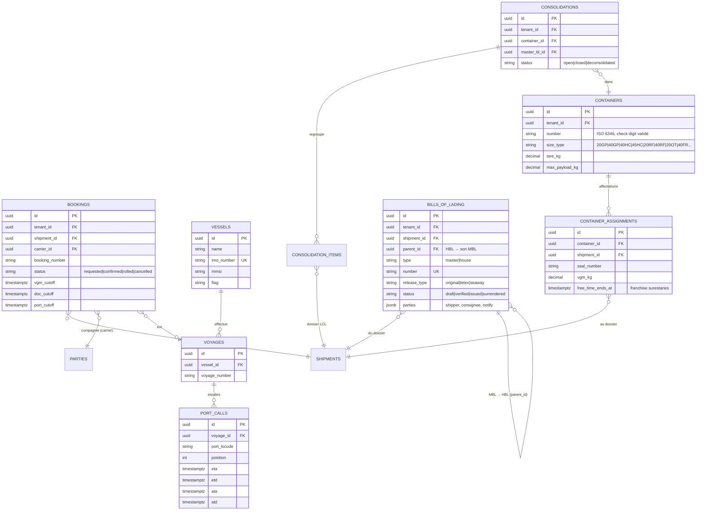

### 5.5 Aérien & Routier

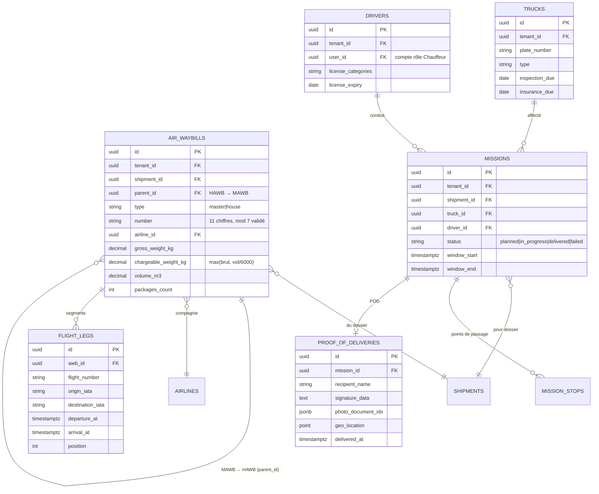

### 5.6 Tracking, Documents, Cotation, Facturation, Intégrations

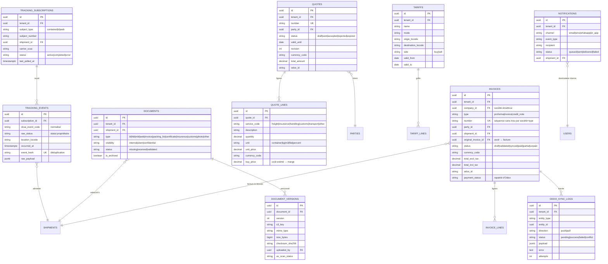

Tables transverses non détaillées ici (Étape 6) : `audit_logs` (append-only), `outbox_events`, `webhook_endpoints` + `webhook_deliveries`, `api_keys`, `notification_preferences` (matrice canal × événement), `notification_templates`, `saved_views`, `dashboard_widgets`, `exchange_rates`, `sequences` (numérotation sans trou), `portal_accounts`, `carrier_status_mappings`.

---

## 6. Flux métier — diagrammes de séquence

### 6.1 Machine à états — workflow dossier (défaut)

```mermaid
stateDiagram-v2
    [*] --> Creation
    Creation --> Booking : devis accepté / création directe
    Booking --> Depart : booking confirmé + cut-offs OK + docs requis
    Booking --> Booking : rollover (cut-off manqué)
    Depart --> Transit : ATD confirmé (tracking ou manuel)
    Transit --> Arrivee : ATA confirmé
    Transit --> Transit : escales, transbordements, retards
    Arrivee --> Dedouanement : docs douane complets
    Dedouanement --> Livraison : mainlevée douane
    Livraison --> Cloture : POD confirmé + facture émise
    Cloture --> [*]

    note right of Transit : Événements tracking DCSA<br/>recalcul ETA, détection retard
    note right of Cloture : Conditions vérifiées :<br/>livraison + facturation + docs archivés.<br/>Réouverture = permission dédiée
```

Chaque transition = configurable par tenant (étapes, conditions, approbations). Diagramme ci-dessus = workflow par défaut livré.

### 6.2 Séquence — Export maritime FCL (devis → dossier → booking)

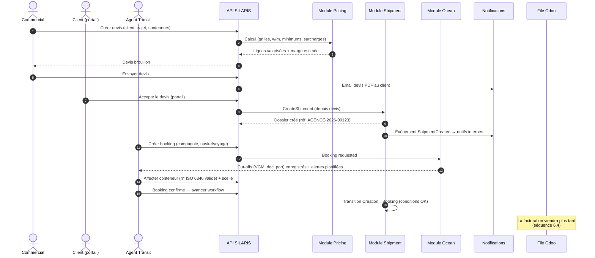

### 6.3 Séquence — Tracking automatique + détection retard

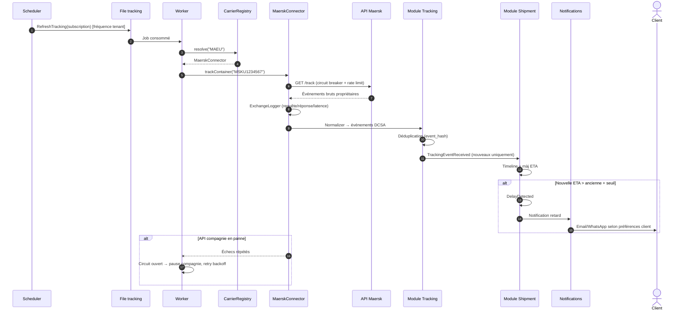

### 6.4 Séquence — Facturation + synchronisation Odoo

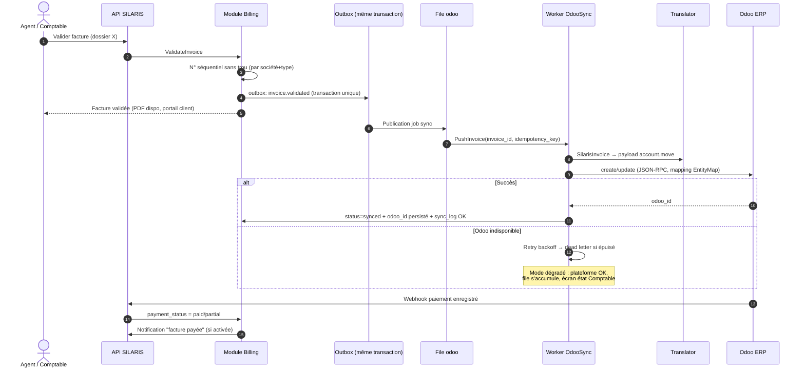

### 6.5 Séquence — Suivi public (invité)

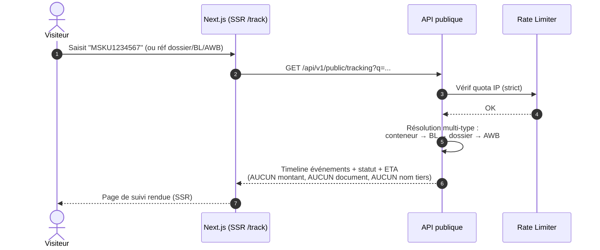

---

## 7. Décisions prises à cette étape

1. **ERD de conception validant ~50 tables cœur** ; entités polymorphes évitées sauf `documents` et `tracking_subscriptions` (subject typé contrôlé).
2. **`parties` unifie clients/prospects/fournisseurs** (type + supplier_kind) — évite 3 tables quasi identiques, simplifie la sync Odoo (res.partner unique côté Odoo).
3. **MBL/HBL et MAWB/HAWB en auto-référence** (`parent_id`) — modélise 1 master → n house naturellement.
4. **`transport_segments`** porte le multimodal — un dossier a 1..n segments ordonnés, chaque segment son mode et son tracking.
5. **Timeline = `shipment_events`** unique (statuts, tracking, docs, commentaires, système) — source unique pour l'affichage chronologique.
6. **Numérotation sans trou** : table `sequences` verrouillée (SELECT FOR UPDATE) par société+type — exigence légale factures.
7. **Franchise surestaries** portée par `container_assignments.free_time_ends_at` → alertes planifiées.
8. Diagrammes en **Mermaid dans le repo** (versionnés, diffables) plutôt qu'images statiques.

---

## 8. Tâches restantes

- Étape 4 : maquettes UI/UX.
- Étape 6 : dictionnaire de données complet, index, contraintes, vues, stratégie d'archivage (raffinement de cet ERD).
- Diagrammes complémentaires produits au fil des étapes concernées (auth Étape 13, déploiement Étape 22).

---

*Fin de l'Étape 3. En attente de validation avant l'Étape 4 — Maquettes UI/UX.*
